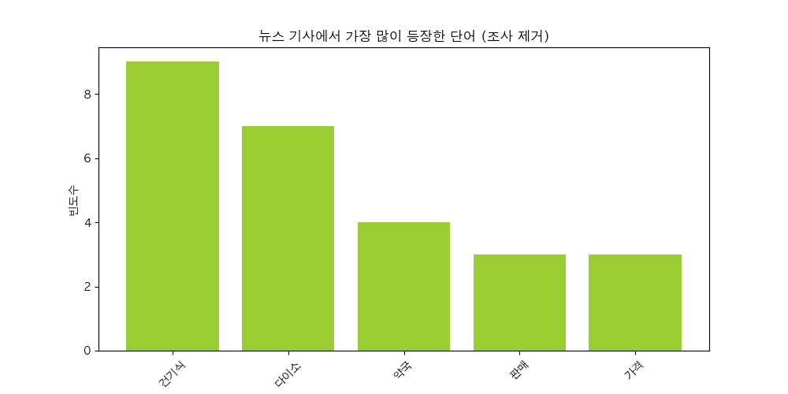

# 네이버 뉴스 감성 분석 프로젝트 🚀  

## 📌 프로젝트 개요  
이 프로젝트는 **네이버 뉴스 API**를 활용하여 데이터를 수집하고,  
텍스트 분석을 통해 **단어 빈도 분석 & 감성 분석**을 수행하는 프로젝트입니다.

## 📂 프로젝트 구조  
📂 naver-news-analysis
┣ 📜 text_analysis.py → 네이버 뉴스 데이터 분석 코드
┣ 📊 wordcloud.png → 워드클라우드 시각화 이미지
┣ 📊 word_frequency.png → 단어 빈도 막대그래프
┣ 📊 sentiment_analysis.png → 감성 분석 결과 파이차트
┗ 📜 README.md → 프로젝트 설명 파일

## 🛠 사용된 라이브러리  
- `requests` → **네이버 뉴스 API 요청**  
- `pandas` → **데이터 분석**  
- `matplotlib` → **데이터 시각화**  
- `wordcloud` → **워드클라우드 생성**  
- `soynlp` → **한글 감성 분석**  

## 📊 주요 기능  
✔ **네이버 뉴스에서 기사 데이터 수집**  
✔ **조사 및 불용어 제거 후 단어 빈도 분석**  
✔ **워드클라우드 생성**  
✔ **감성 분석 (긍정/부정/중립 뉴스 비율 분석)**  

## 📸 결과 시각화

### 단어 빈도 그래프  
 

### 워드클라우드  
  

### 감성 분석 결과  
  

## 🤖 결론 및 한계점
이 프로젝트에서는 네이버 뉴스 데이터를 활용하여 감성 분석을 진행하였습니다.  
그러나 모든 뉴스 기사가 **중립적인 감성 점수(0점)를 기록**하는 결과가 나왔습니다.  

###  원인 분석  
1️⃣ 뉴스 기사는 사실 전달에 초점을 맞추기 때문에 감성적으로 치우치지 않는 경향이 있음.  
2️⃣ 감성 분석 모델이 사전 기반으로 동작하기 때문에 감성 단어가 적은 문장에서 분석이 어려움.  

### 해결책
❗ 뉴스 기사의 감성적인 표현을 더 잘 반영할 수 있도록 **사전(word dictionary) 확장**이 필요함.

❗️ 이러한 한계를 고려하면, **단순 감성 분석보다 뉴스 기사의 키워드 분석, 문맥 기반 분석이 더욱 효과적일 것 같음.**  